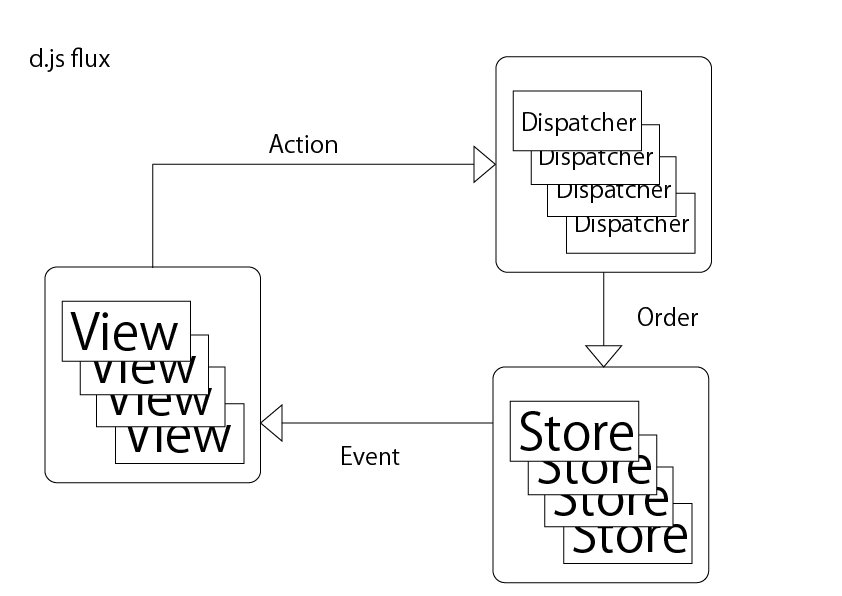

# ydj

react flux framework

## install

```shell
npm i ydj
// or
yarn add ydj
```

## ydj flux



## usage

```typescript
  import React from 'react';
  import {useStore, dispatch, Store} from 'ydj';
  /**
   * Store Class
   * @note Store<StateType>
   */ 
  class CountStore extends Store<number> {
    state: number = 0;
    /**
     * @key actionName
     * @value actionCallback
     */
    actions = {
      countUp: this.countUp,
      countDown: this.countDown
    };
    countUp() {
      this.state++;
    }
    countDown() {
      this.state--;
    }
  }

  /**
   * React Component
   */
  function counter() {
    /**
     * useStore(StoreClass, initialState)
     * dispatch(actionName, arg)
     */
    const count = useStore(CountStore, 0);
    return (
      <div>
        <div>カウント: {count}</div>
        <div>
          <button onClick={() => dispatch('countUp')}>+</button>
          <button onClick={() => dispatch('countDown')}>-</button>
        </div>
      </div>
    );
  }

```
